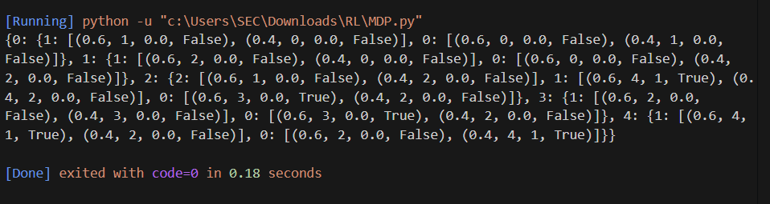

# MDP REPRESENTATION

## AIM:
The aim of this experiment is to create a Markov Decision Process (MDP) representation and implement it in Python to model the decision-making process in a medical treatment scenario.
## PROBLEM STATEMENT:

### Problem Description
The problem involves managing the treatment of patients who can be in one of four states: Sitting,Stand, Walk,Crashed and Run. The objective is to determine whether to check patient is able to Run.

### State Space
State 0: Sitting
State 1: Stand
State 2: Walk
State 3: Crashed
State 4: Run

{Sitting,Stand, Walk,Crashed ,Run} -> {0, 1, 2,3,4}


### Sample State
State: Sitting
Sitting -> 0
(The patient is Sitting, represented numerically as 0.)
### Action Space
Action 0: Sitting
Action 1: Standing etc....

{Treat, Not Treat} -> {0, 1}


### Sample Action
Action: Stand
Treat -> 1
(The action taken is to Stand patient, represented numerically as 1.)

### Reward Function
R = { +1 , if the patient state is changed to Run state or not, otherwise -1}

Transition to Run state: +1
Staying sick : -1
Terminal states: No reward
### Graphical Representation


## PYTHON REPRESENTATION:
```python
p = {
    0:{
        1:[(0.6,1,0.0,False),(0.4,0,0.0,False)],
        0:[(0.6,0,0.0,False),(0.4,1,0.0,False)]
    },
    1:{
        1:[(0.6,2,0.0,False),(0.4,0,0.0,False)],
        0:[(0.6,0,0.0,False),(0.4,2,0.0,False)]
    },
    2:{
        #lef
        2:[(0.6,1,0.0,False),(0.4,2,0.0,False)],
        #righ
        1:[(0.6,4,1,True),(0.4,2,0.0,False)],
        #up
        0:[(0.6,3,0.0,True),(0.4,2,0.0,False)]
    },
    3:{
        1:[(0.6,2,0.0,False),(0.4,3,0.0,False)],
        0:[(0.6,3,0.0,True),(0.4,2,0.0,False)]
        
    },
    4:{
        1:[(0.6,4,1,True),(0.4,2,0.0,False)],
        0:[(0.6,2,0.0,False),(0.4,4,1,True)]
    }
}
print(p)

```

## OUTPUT:


## RESULT:
The Markov Decision Process (MDP) has been successfully represented using Python dictionaries. Each state-action pair contains information about possible transitions, transition probabilities, associated rewards, and whether the next state is terminal or not. This representation can be used for further analysis and decision-making algorithms such as reinforcement learning.


