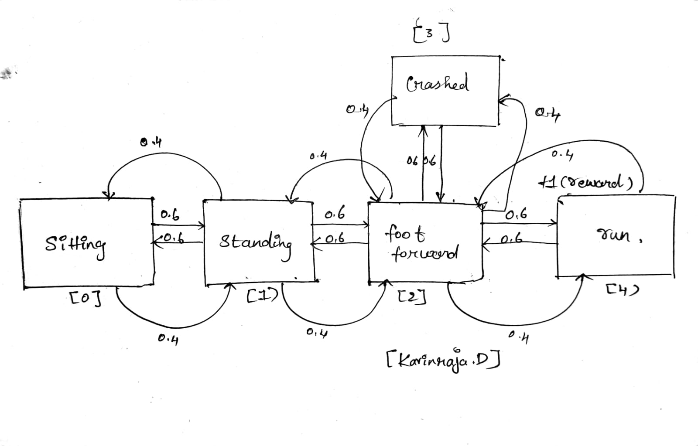

# MDP REPRESENTATION

## AIM:
The aim of this experiment is to create a Markov Decision Process (MDP) representation and implement it in Python to model the decision-making process in a medical treatment scenario.
## PROBLEM STATEMENT:

### Problem Description
The problem involves managing the treatment of patients who can be in one of three states: healthy, mildly sick, or seriously sick. The objective is to determine whether to administer treatment or not for a mildly sick patient, considering the potential outcomes and rewards associated with each action.

### State Space
State 0: Healthy
State 1: Mildly Sick
State 2: Seriously Sick

{Healthy, Mildly Sick, Seriously Sick} -> {0, 1, 2}


### Sample State
State: Healthy
Healthy -> 0
(The patient is Healthy, represented numerically as 0.)
### Action Space
Action 0: Treat
Action 1: Not Treat

{Treat, Not Treat} -> {0, 1}


### Sample Action
Action: Treat
Treat -> 0
(The action taken is to Treat patient, represented numerically as 0.)

### Reward Function
R = { +1 , if the patient state is changed to healthy state or not, otherwise -1}

Transition to healthy state: +1
Staying sick: -1
Terminal states: No reward
### Graphical Representation


## PYTHON REPRESENTATION:
```python
import gym
import gym_walk
#P = gym.make('BanditWalk-v0').env.P
# Creating Dictionary
# MDP Representation in Python
p = {
    0:{
        1:[(0.6,1,0.0,False),(0.4,0,0.0,False)],
        0:[(0.6,0,0.0,False),(0.4,1,0.0,False)]
    },
    1:{
        1:[(0.6,2,0.0,False),(0.4,0,0.0,False)],
        0:[(0.6,0,0.0,False),(0.4,2,0.0,False)]
    },
    2:{
        #lef
        2:[(0.6,1,0.0,False),(0.4,2,0.0,False)],
        #righ
        1:[(0.6,4,1,True),(0.4,2,0.0,False)],
        #up
        0:[(0.6,3,0.0,True),(0.4,2,0.0,False)]
    },
    3:{
        1:[(0.6,2,0.0,False),(0.4,3,0.0,False)],
        0:[(0.6,3,0.0,True),(0.4,2,0.0,False)]
        
    },
    4:{
        1:[(0.6,4,1,True),(0.4,2,0.0,False)],
        0:[(0.6,2,0.0,False),(0.4,4,1,True)]
    }
}
print(p)

```

## OUTPUT:


## RESULT:
The Markov Decision Process (MDP) has been successfully represented using Python dictionaries. Each state-action pair contains information about possible transitions, transition probabilities, associated rewards, and whether the next state is terminal or not. This representation can be used for further analysis and decision-making algorithms such as reinforcement learning.


